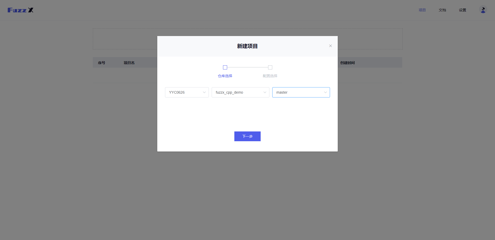
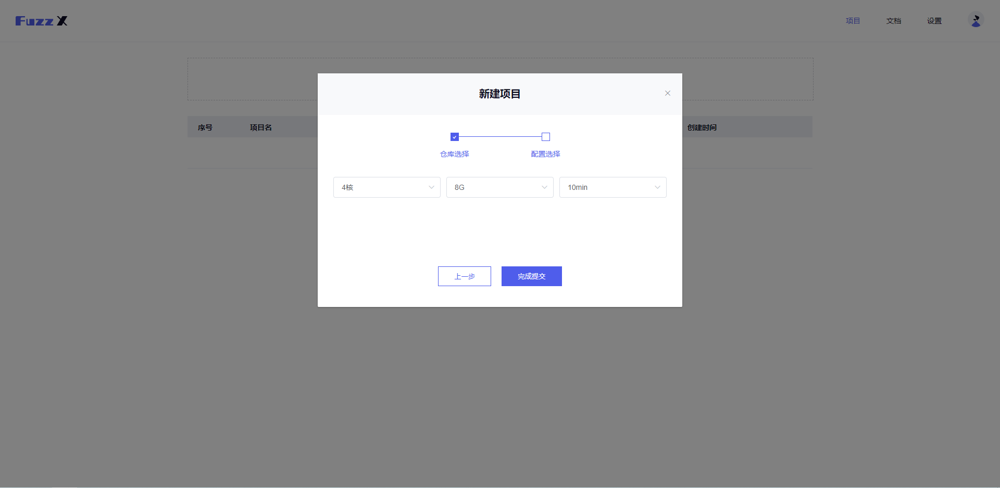

# 挖掘漏洞

配置好项目结构之后，你就可以开始您的`Fuzz`了！

> 请先将我们将的示例项目`fork`到您的`GitHub`仓库。 [项目地址](https://github.com/guardstrikelab/fuzzx_cpp_demo)

1.首先，进入`fuzzx`的[网站](http://fuzzx.guardstrike.com/)，点击黑色的“GitHub“按钮登陆您的`GitHub`账号；

2.点击“创建新项目”；

3.依次选择用户名、项目名、分支后，点击”下一步“；

4.选择核心数、内存分配、运行时间，选完后点击”完成提交“。

5.完成后，您可看到个人主页的任务列表里已经添加了您刚才指定的项目；

6.点击任务列表中的该条目，您可以看到一些更具体的具体细节：

7.点击具体的缺陷条目，即可看到其具体信息：

在下一节您将看到如何修复漏洞。

