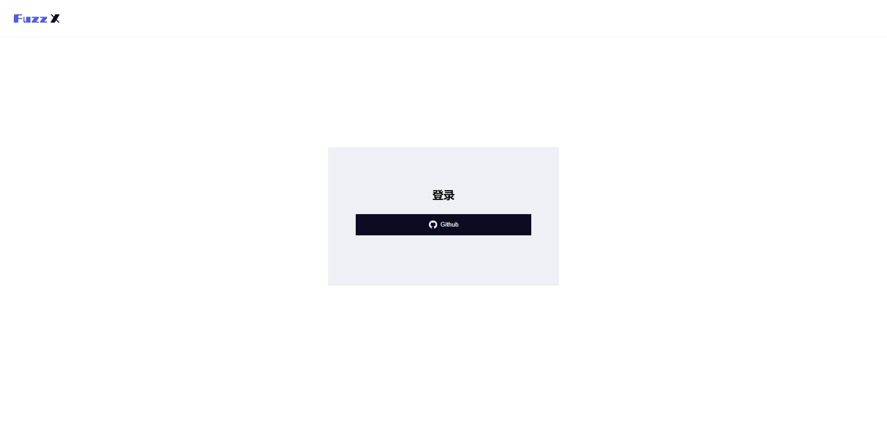
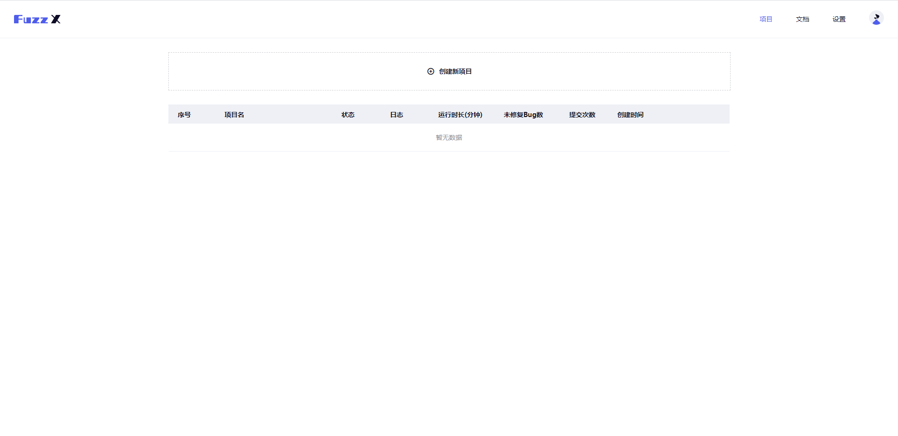
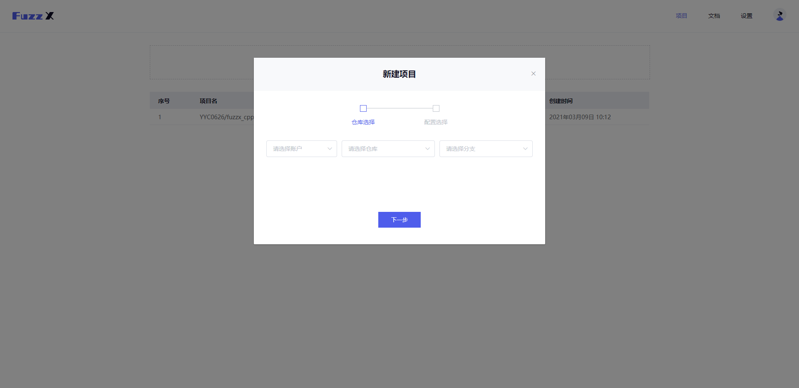
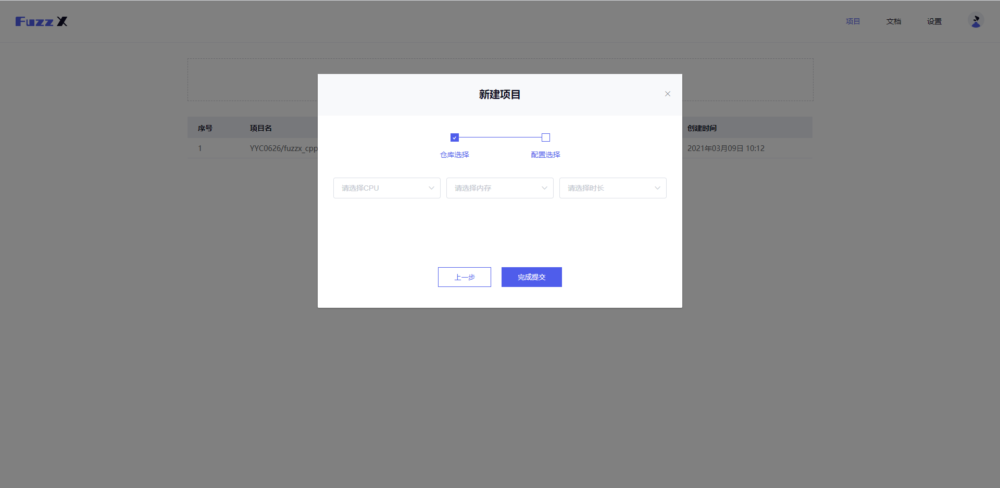
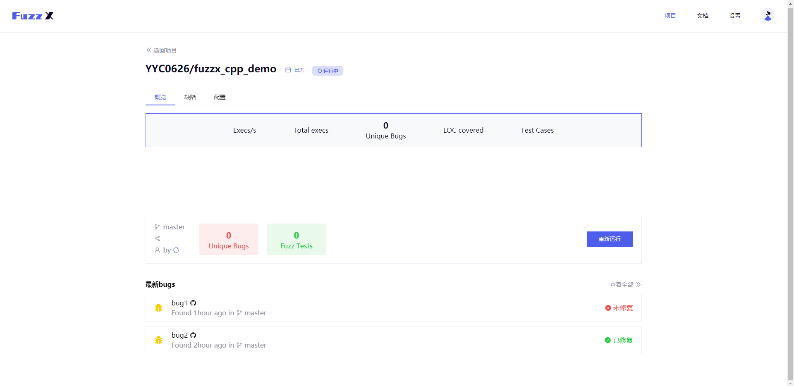
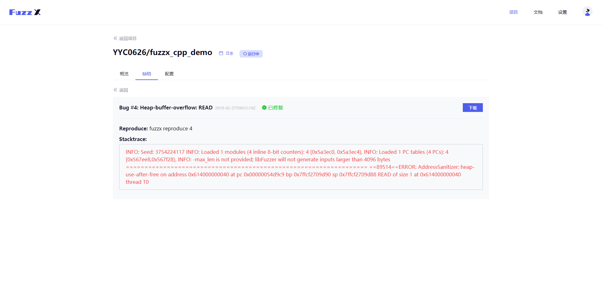
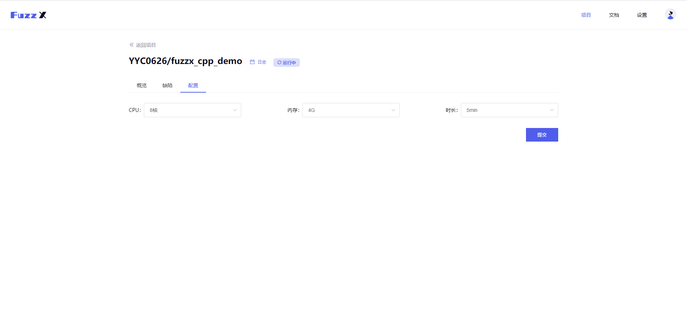

# 内部细节

#### 1.首页

首页的黑色按钮是`GitHub`授权登录按钮，点击即可通过`GitHub`授权进行登录。

#### 2.个人主页

此页是用户初次登录后看到的页面，主页内容包含新建项目按钮、项目列表；页面右上角有`FuzzX`文档、设置以及个人信息选项。

#### 3.新建项目

首先点击主页的“创建新项目”区域，依次选择下图中的用户、项目以及分支；

选择完成后点击“下一步”，选择为项目分配的`Fuzzing`引擎配置：CPU核心数、内存、运行时长；

选完后可点击“完成提交”。

#### 4.任务列表

按条显示已创建的任务，以及对应的运行状态还有运行日志。

#### 5.任务详情

点击任务列表中的某一条目即可跳转到该任务的具体信息。

 此页的“概览”由上到下依次了显示项目的运行信息，项目的仓库、分支、已发现缺陷数等属性、“重新运行”按钮和缺陷概览列表。

#### 6.缺陷详情

在缺陷列表里点击某一具体的缺陷，即可跳转到详情页面，该页面显示缺陷名称、发现时间、缺陷状态，在本地命令行复现的命令，以及程序崩溃时具体的堆栈信息。点击蓝色“下载”按钮可以下载到当时的发现该缺陷时输入的测试用例。

#### 7.项目配置

而在项目详情页的“配置”选项下，您可以修改运行该项目的`Fuzzing`引擎配置，修改完成点击“提交”按钮后即可生效。

#### 8.用户信息

而当你将鼠标移动到右上角的头像处，你将会看到用于CLI工具登录的`id`与`key`（可点击复制），以及退出登录按钮。

